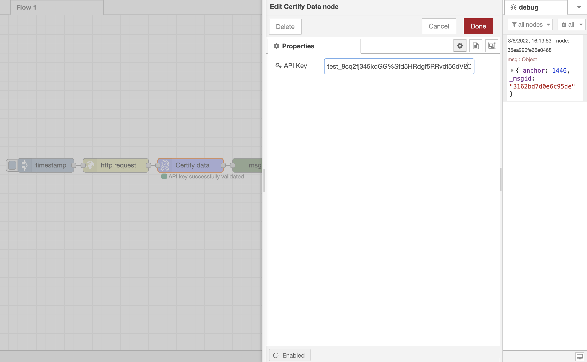

# node-red-contrib-bloock

## Installation

     npm install node-red-contrib-bloock

## Features

Record all your data on Ethereum Mainnet with right privacy

## Getting API Key

Follow the [getting started](https://docs.bloock.com/#/getting-started/) guideline to get an API key

## Example node

