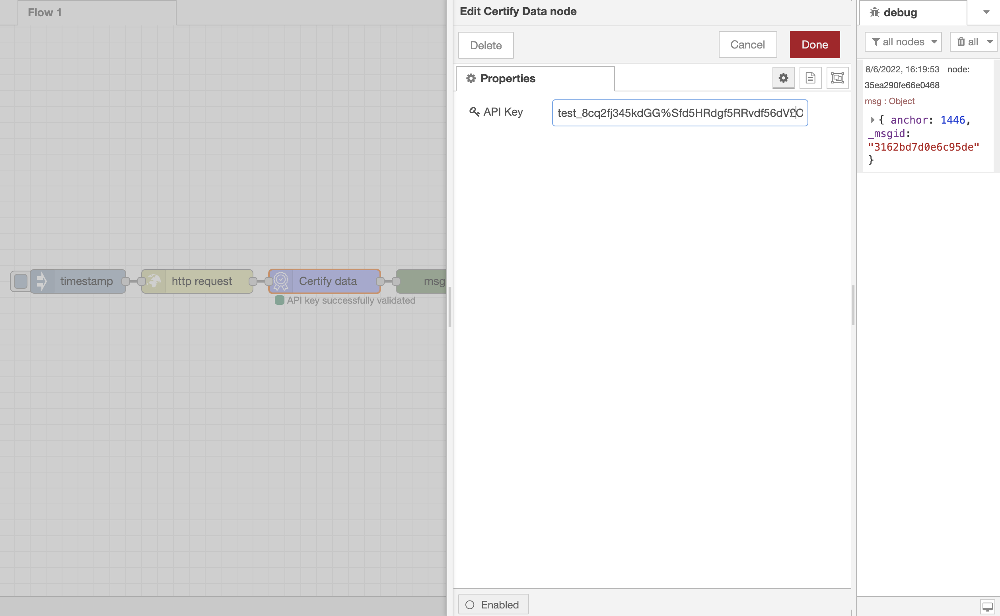

# Node RED for BLOOCK

## Installation

     npm install @bloock/node-red-contrib-bloock

## Features

[BLOOCK](https://bloock.com) is a simple and scalable software that allows you to record and validate any data against multiple public blockchains. Our solution is designed in a way to evade all capacity and scalability-related challenges faced with Blockchain Technology.

## Getting API Key

Follow the [getting started](https://docs.bloock.com/#/getting-started/) guideline to get an API key

## Example node

